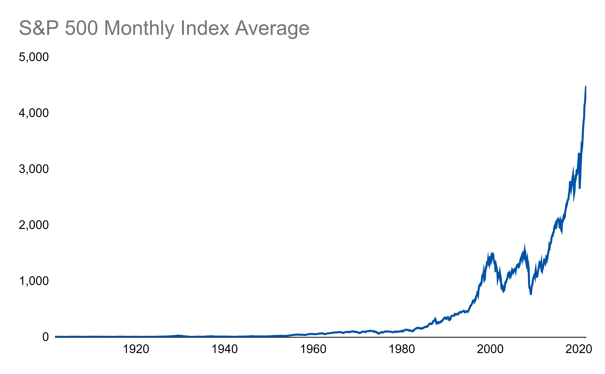

# 517-watson-stocks
 

 ## Introduction to Stocks

Stocks can be a great way to achieve personal wealth and ensure a stable retirement

## How to start investing
1. Open a stock brokerage account
2. Invest in an index fund or a mutual fund for low-risk
3. Invest gradually over time

### Resources to help you learn
- [Investopedia](https://www.investopedia.com/)
- [Yahoo Finance](https://finance.yahoo.com/)
- [Brokerages](https://www.nerdwallet.com/best/investing/online-brokers-for-stock-trading)

# S&P 500 over time

